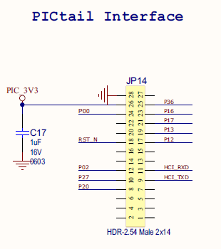
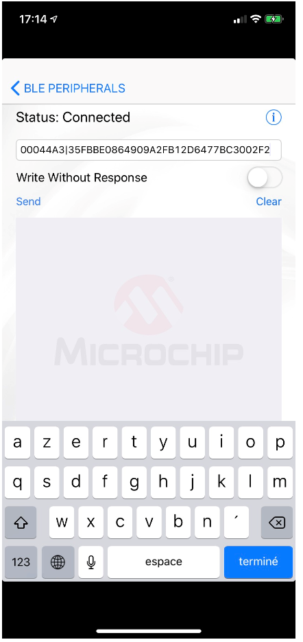

# ATSAMR34_RN487x_LORAWAN_BLE


> “Wireless Made Easy!" - Adding BLE features & provisioning to an existing LoRaWAN Application

<p>
<a href="https://www.microchip.com" target="_blank">

</a>
</p>

## ⚠ Disclaimer

<p><span style="color:red"><b>
THE SOFTWARE ARE PROVIDED "AS IS" AND GIVE A PATH FOR SELF-SUPPORT AND SELF-MAINTENANCE.</br></br>
This repository contains unsupported example code intended to help accelerate client product development. It is not validated for production nor audited for security best-practices.</br></br>
Note that while this repository is unsupported, Microchip welcome community contributions, and all pull-requests will be considered for inclusion into the repository.
</span></p></b>

> Interact with peers in the community at [LoRa Forum](https://www.microchip.com/forums/f512.aspx).

## Abstract

**This sample code demonstrates how to provision & control a LoRaWAN end-device over a BLE connection between Smartphone App and a RN4870/71 module.**


## Sample Applications

[Clone/Download](https://docs.github.com/en/free-pro-team@latest/github/creating-cloning-and-archiving-repositories/cloning-a-repository) the current repo to get the software.

## A la carte

1. [Material required](#step1)
2. [Software](#step2)
3. [Hardware setup](#step3)
4. [Mobile Apps](#step4)
5. [TTN Provisioning](#step5)
6. [Generating QR Code for End-device provisioning](#step6)
7. [BLE + LoRaWAN in a single Application](#step7)
6. [Run the demo](#step8)

## Material required <a name="step1"></a>

Purchase the <a href="https://www.microchip.com/DevelopmentTools/ProductDetails/PartNO/RN-4871-PICTAIL" target="_blank">RN4871-PICTAIL evaluation kit</a>
</br>
The RN-4871-PICtail is a development board based on the ultra-compact Bluetooth 5 Low Energy RN4871 module. The RN4871 uses a simple ASCII command interface over the UART. 

</br>

OR

Alternatively, you can use a RN4870 or RN4871 click board from Mikroe.


https://www.mikroe.com/rn4870-click
https://www.mikroe.com/rn4871-click

And use mikroBUS Xplained-Pro board (ATMBUSADAPTER-XPRO).

https://www.microchip.com/Developmenttools/ProductDetails/ATMBUSADAPTER-XPRO

With or without wiring...


> For this tutorial, the RN487x module is loaded with Firmware version 1.41

Purchase the <a href="https://www.microchip.com/Developmenttools/ProductDetails/DM320111" target="_blank">SAM R34 Xplained Pro Evaluation Kit</a>
</br>

</br>

OR

Purchase the <a href="https://www.microchip.com/DevelopmentTools/ProductDetails/PartNO/EV23M25A" target="_blank">WLR089U0 Xplained Pro Evaluation Kit</a>
</br>

</br>

Purchase a LoRa(r) Gateway from <a href="https://www.thethingsnetwork.org/docs/gateways/" target="_blank">The Things Network</a>
</br>

## Software <a name="step2"></a>

- Download and install [Microchip Studio 7.0 IDE](https://www.microchip.com/mplab/microchip-studio).
- Open Microchip Studio 7.0 IDE.
- From **Tools - > Extensions and updates**, install Advanced Software Framework (ASFv3) v3.49.1 release or upper release.
- Restart Microchip Studio

- Download and install a serial terminal program like [Tera Term](https://osdn.net/projects/ttssh2/releases/).

## Hardware setup <a name="step3"></a>

To demonstrate BLE applications as well as LoRaWAN end-device provisioning, follow the connection below :





- In order to connect in LoRaWAN, you will need to be in range of your gateway. If you don’t have gateway, check the world map (https://www.thethingsnetwork.org/map) to see if your local community has gateway deployed around your location.
- Plug the antennas and always make sure you have the antennas plugged to your boards before powering it up. </br>
- Connect the ATSAMR34-Xpro board to the PC through the micro-USB cables. </br>
USB cable must be connected to the EDBG USB connectors of the ATSAMR34 kit. </br>
The USB ports powers the board. 
- Connect the FTDI cable the host PC. A COM port will be mounted. This port mounted will be used to communicate with the kit. </br>
- Launch Tera Term program and configure the serial ports mounted with: 115200 bps, 8/N/1 </br>

> **If you are using a WLR089U0 Xplained Pro board, the hardware setup is exactly the same as for the SAMR34 Xpro board.**

## Mobile Apps <a name="step4"></a>

This demo requires:
- Microchip Bluetooth Data (MBD) Apps for mobile
</br>
For Google device: https://play.google.com/store/apps/details?id=com.microchip.bluetooth.data&hl=en
</br>
For Apple device: https://apps.apple.com/us/app/microchip-bluetooth-data/id1319166097
</br>
- Microchip Bluetooth Smart Data
</br>
For Apple device: https://apps.apple.com/fr/app/bluetooth-smart-data/id1004033562
</br>
or
- BLE Terminal
</br>
For Google device: https://play.google.com/store/apps/details?id=de.kai_morich.serial_bluetooth_terminal&hl=en
</br>
For Apple device: https://apps.apple.com/fr/app/ble-terminal-hm-10/id1398703795
</br>
This demo is using QRbot apps to scan a QR code. This QRcode contains the LoRaWAN provisioning information.
</br>
QRbot is available for Google device: https://play.google.com/store/apps/details?id=net.qrbot&hl=en
</br>
QRbot is available for Apple device: https://apps.apple.com/cy/app/qrbot/id1048473097

## TTN Provisioning <a name="step5"></a>

- Log in to your TTN account
- Go to the Console
- Create an Application and note the AppEUI generated by TTN
- From the application created, add a Device
- For the DevEUI, use the MAC address written in the back of the SAMR34 Xplained Pro board.

- Let TTN generate the AppKey


When the device is created, note carrefully the OTAA credentials (DevEUI, AppEUI, AppKey). 
You will needed later to generate the QR Code.

You have done the provisioning of the end-device within the TTN Console.


## Generating QR Code for End-device provisioning <a name="step6"></a>

A QR Code will be used to provision the LoRaWAN OTAA parameters (DevEUI, AppEUI, AppKey) over BLE.

To be recognized by the SAMR34 sample application, the QR code must contains a string of characters which respect the following format:


Create your own QR Code from: https://www.unitag.io/qrcode
- As QR Code Type: select Other and Text
- In the textbox, type your own string of characters with the help of your OTAA credentials
- Click confirm to generate your own QR Code


You can download and print your QR Code.

From your smartphone, Open the QRbot apps and scan your QR Code. 


You should retrieve the "mac set otaa" command with your credentials.
Copy the text.


## BLE + LoRaWAN in a single Application <a name="step7"></a>

This project integrates the Microchip LoRaWAN Stack (MLS) Software API which provide an interface to the different software modules. </br></br>
This application is based on LoRaWAN Mote Application generated from ASFv3 and already contains drivers required to interface the RN4870/71 module.

It implements the Transparent UART service. This service exposes the characteristics to transfer serial data on both direction.

From the menu, you have the choice of the application:


## Run the demo <a name="step8"></a>

- Start Microchip Studio 7 IDE
- Open the project
- From the menu, go to: Build -> Build Solution
- Flash the firmware on the ATSAMR34 Xplained Pro board or onto the WLR089 Xpro
- To get console logs through EDBG interface, open a Tera Term session with 115200 bps 8N1 configuration.
- Reset the board
- The application will start and should expose a menu if the interface with RN4870/71 module is correct</br>

```
Try to initialize BLE device ...

===============================================
Menu: select a BLE application from the list
===============================================
1) Serial bridge
2) Beacon mode - https://www.microchip.com URL
3) Transparent chat mode
4) Scan mode
5) Search mode
6) Search and connect
7) Sleep mode
8) Wake-up
9) LoRaWAN provisioning
-----------------------------------------------
>>
```

- From here, simply select a BLE application you want to be executed</br>
- And follow the instructions displayed on the console

## Serial bridge


## Beacon mode


## Transparent chat mode


## Scan mode


## Search mode


## Search and connect


## Sleep mode


## Wake-up 


## LoRaWAN provisioning





- From here, the SAMR34 will automatically send a Join Request message to activate the device within the LoRaWAN nettwork
- If the activation succeed, you will be notified by a "Joining Successful" message on the BLE apps
- Go back to the TTN Console, <your application> and observe the Application Data of your device
- You should see the Join procedure

- Go back to the TTN Console and observe the data received in HEX

